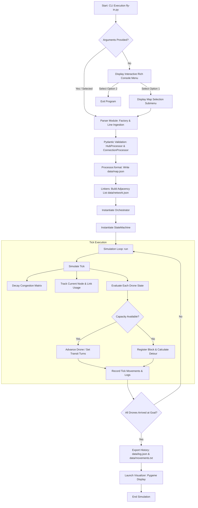
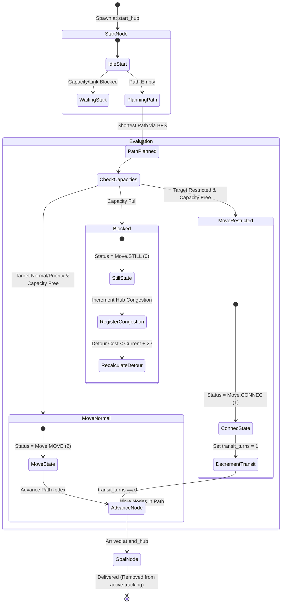

*This project has been created as part of the 42 curriculum by agalvan-.*

# Fly-In: Autonomous Drone Swarm Fleet Routing & Simulation Engine

## Table of Contents
1. [Description](#description)
2. [Theoretical Foundations & Algorithmic Architecture](#theoretical-foundations--algorithmic-architecture)
   - [Graph Theory & Adjacency Representation](#graph-theory--adjacency-representation)
   - [Pathfinding & Custom Heuristic Strategy](#pathfinding--custom-heuristic-strategy)
   - [Congestion Management & Exponential Decay Model](#congestion-management--exponential-decay-model)
   - [Discrete-Time State Machine Mechanics](#discrete-time-state-machine-mechanics)
   - [Object-Oriented Architecture & Design Patterns](#object-oriented-architecture--design-patterns)
3. [System Flowcharts & State Machine Diagrams](#system-flowcharts--state-machine-diagrams)
   - [Overall System Architecture Diagram](#overall-system-architecture-diagram)
   - [Drone State Life Cycle Diagram](#drone-state-life-cycle-diagram)
4. [Docker Architecture & Makefile Deep-Dive](#docker-architecture--makefile-deep-dive)
   - [Docker Theoretical Foundations](#docker-theoretical-foundations)
   - [X11 Graphic Forwarding Architecture](#x11-graphic-forwarding-architecture)
   - [Makefile Targets Explained](#makefile-targets-explained)
5. [Visual Representation & User Experience](#visual-representation--user-experience)
6. [Instructions & Usage](#instructions--usage)
   - [Prerequisites](#prerequisites)
   - [Docker Workflow (Recommended)](#docker-workflow-recommended)
   - [Local Development Workflow](#local-development-workflow)
7. [Input & Output Examples](#input--output-examples)
   - [Input Map Format](#input-map-format)
   - [Output Format](#output-format)
8. [Resources & AI Usage Declaration](#resources--ai-usage-declaration)

---

## Description

**Fly-In** is a high-performance, discrete-time autonomous drone swarm simulation engine designed to route multiple aerial vehicles ($N$ drones) through complex topological spatial networks from a designated start hub (`start_hub`) to a goal hub (`end_hub`) in the minimum possible number of simulation turns.

The system addresses critical challenges in autonomous traffic management, including capacity constraint enforcement (node occupant limits and link throughput limits), dynamic obstacle routing, zone hazard delays (restricted and blocked zones), and multi-agent spatial conflict resolution.

Key features include:
- **Strict Validation & Type Safety**: Full adherence to PEP 8 (`flake8`) and static typing standards (`mypy --strict`), leveraging Pydantic models for data validation.
- **Robust Algorithmic Engine**: Custom graph traversal algorithms handling zone movement penalties, node capacity constraints, link capacity bottlenecks, dynamic detour routing, and congestion decay.
- **Dual Visualizer System**: High-level terminal output powered by `rich` alongside a graphical visualization powered by `pygame`.
- **Containerized Environment**: Full Docker and Makefile integration for reproducible builds and cross-platform GUI execution.

---

## Theoretical Foundations & Algorithmic Architecture

### Graph Theory & Adjacency Representation

The airspace is mathematically modeled as an undirected topological graph $G = (V, E)$, where:
- $V = \{v_1, v_2, \dots, v_n\}$ represents the set of **Hubs** (zones) in the network. Each vertex $v \in V$ is bound to spatial coordinates $(x, y) \in \mathbb{Z}^2$, a max drone capacity $C_v \in \mathbb{N}^+$, and a zone classification $Z_v \in \{\text{normal}, \text{blocked}, \text{restricted}, \text{priority}\}$.
- $E = \{e_1, e_2, \dots, e_m\}$ represents the set of **Connections** (edges) linking hubs. Each edge $e = (u, v) \in E$ has a link capacity $C_e \in \mathbb{N}^+$ defining the maximum number of drones that can simultaneously traverse the channel.

The system uses an **Adjacency List** data structure to store network topology ($A[u] = \{v \in V \mid (u, v) \in E\}$). Adjacency list representation provides optimal memory complexity $\mathcal{O}(\vert{}V\vert{} + \vert{}E\vert{})$ and efficient neighbor traversal during graph search operations.

### Pathfinding & Custom Heuristic Strategy

To route drones through $G$, the system employs a modified **Breadth-First Search (BFS)** algorithm tailored for topological graphs with variable zone attributes:

1. **Unweighted Shortest Path Guarantee**: BFS naturally yields the shortest path in terms of hop count on unweighted graph structures.
2. **Priority Zone Preference**: During neighbor expansion, adjacent nodes are dynamically prioritized using a custom sorting heuristic:
   $$\text{weight}(n) = \begin{cases} 0 & \text{if } Z_n = \text{priority} \\ 1 & \text{otherwise} \end{cases}$$
   By sorting neighbors such that priority zones appear first in the traversal queue, the algorithm naturally favors high-throughput pathways when multiple equal-length paths exist.
3. **Dynamic Exclusion Sets**: The pathfinding method `get_shortest_valid_path(start, goal, restricted_nodes)` dynamically filters out blocked nodes ($Z_v = \text{blocked}$) and congested hotspots supplied in `restricted_nodes`.

### Congestion Management & Exponential Decay Model

When multiple drones attempt to enter a hub or traverse a connection exceeding capacity, spatial contention occurs. The simulation incorporates a feedback loop based on **Exponential Congestion Decay**:

1. **Block Registration**: When a drone is halted due to capacity constraints, the target hub's congestion metric is incremented:
   $$\Omega(v) \leftarrow \Omega(v) + 1$$
2. **Exponential Decay**: At every simulation tick, congestion values across all recorded hubs decay according to:
   $$\Omega(v) \leftarrow \Omega(v) \times 0.9$$
   If $\Omega(v) < 0.05$, the congestion entry is pruned from memory to prevent memory overhead.
3. **Hotspot Detour Planning**: When planning a path, if a node in the computed path has a congestion level exceeding its capacity ($\Omega(n) \ge C_n$), it is flagged as a hotspot. The pathfinder calculates a detour avoiding these hotspots. If the detour length satisfies:
   $$\text{Length}(\text{detour}) \le \text{Length}(\text{original}) + 2$$
   the drone adopts the detour, mitigating bottleneck formation across the swarm.

### Discrete-Time State Machine Mechanics

The simulation advances in discrete time steps called **ticks** ($t \in \mathbb{N}$). At each tick, every drone $d \in D$ transitions according to its current state and environmental capacity:

- **Zone Movement Costs**:
  - `normal` / `priority`: 1 turn traversal cost.
  - `restricted`: 2 turns traversal cost (1 turn in transit connection, 1 turn entering destination hub).
  - `blocked`: Inaccessible ($\infty$ cost).
- **Turn Execution Phases**:
  1. **Capacity Accounting Phase**: Calculate current node occupancies ($\text{Usage}(v)$) and channel transit occupancies ($\text{Usage}(e)$).
  2. **Movement Evaluation Phase**: Iterate over all drones:
     - If the drone is in transit toward a `restricted` zone (`transit_turns > 0`), decrement its turn counter. Upon reaching 0, advance the drone to the target hub (`Move.MOVE`).
     - If the drone is stationary, evaluate target node capacity ($C_v$) and link capacity ($C_e$). If $\text{Usage}(v) < C_v$ and $\text{Usage}(e) < C_e$, allocate passage.
     - If destination is `restricted`, set `transit_turns = 1` and mark status as `Move.CONNEC`.
     - If capacity is exhausted, register a block event, attempt detour recalculation, and mark status as `Move.STILL`.

### Object-Oriented Architecture & Design Patterns

The codebase is built on SOLID object-oriented principles:


```

fly-in/
├── algorithmic/
├── display/
├── organisms/
├── parser/
└── processor/

```

- **Abstract Base Class (`Processor`)**: Defines the template for map data ingestion and JSON schema formatting (`data/map.json`).
- **Data Validation & Type Safety (`Pydantic`)**:
  - `HubProcessor`: Validates coordinate pairs, zone classifications (`normal`, `blocked`, `restricted`, `priority`), capacity bounds ($C_v > 0$), and color properties via `pygame.Color`.
  - `ConnectionProcessor`: Validates dash-delimited connection identifiers and link capacity limits ($C_e \ge 1$).
- **Factory Pattern (`Factory`)**: Parses raw text files line-by-line, extracts metadata enclosed in brackets (`[...]`), and instantiates appropriate processor entities.
- **Linker Engine (`Linkers`)**: Converts processed hub and connection maps into an adjacency list saved to `data/network.json`.
- **Orchestration & State Management (`Orchestrator`, `StateMachine`, `Drone`)**: Decouples network queries, path calculations, state execution, and drone instance tracking.

---

## System Flowcharts & State Machine Diagrams

### Overall System Architecture Diagram

The flowchart below illustrates the end-to-end operational pipeline from raw map text file ingestion to visual rendering and log exportation:



---

### Drone State Life Cycle Diagram

The finite state machine governing individual drone movement across discrete ticks is detailed below:



---

## Docker Architecture & Makefile Deep-Dive

### Docker Theoretical Foundations

**Docker** provides operating-system-level virtualization (containerization) to deliver isolated, reproducible software environments. Unlike traditional hardware virtualization (Virtual Machines using Hypervisors), containers share the host operating system's Linux kernel while maintaining isolated file systems, process trees, and network interfaces.

Key concepts leveraged in this project's `Dockerfile`:

1. **Base Image (`python:3.12-slim`)**: A minimal Debian-based Linux image that minimizes storage footprint while providing standard C library runtimes.
2. **Environment Configuration**:
* `PYTHONDONTWRITEBYTECODE=1`: Prevents Python from writing `.pyc` bytecode files to disk, keeping the container filesystem clean.
* `PYTHONUNBUFFERED=1`: Ensures standard output (`stdout`) and error streams (`stderr`) are flushed immediately to container logs without buffering.
* `POETRY_VIRTUALENVS_CREATE=false`: Installs Python packages globally within the container, reducing virtual environment overhead.


3. **Dependency Layering & Caching**: Apt dependencies (`libx11-6`, `libgl1`, `libsdl2-2.0-0`) and Poetry package definitions are copied and installed in early docker layers to leverage layer caching during image rebuilds.

### X11 Graphic Forwarding Architecture

Because Pygame requires an active display server to render GUI windows, running it inside an isolated Docker container requires **X11 Display Forwarding**:

* **Linux**: Mounts the host UNIX domain socket `/tmp/.X11-unix` into the container and passes the host `DISPLAY` environment variable (`-e DISPLAY=$DISPLAY`). Software OpenGL rendering (`LIBGL_ALWAYS_SOFTWARE=1`) ensures compatibility across GPU drivers.
* **macOS / Windows**: Routes display commands through `host.docker.internal:0` (or `:0.0`) to communicate with host X11 servers such as **XQuartz** (macOS) or **VcXsrv** (Windows).

### Makefile Targets Explained

The project includes an automated `Makefile` configured to manage builds, code analysis, container execution, and workspace maintenance:

| Makefile Rule | Command / Action | Theoretical Purpose |
| --- | --- | --- |
| `build` | `docker build -t fly-in-image .` | Compiles the Dockerfile into a deterministic Docker image tagged `fly-in-image`. |
| `run` | `docker run --rm -it $(GUI_ARGS) -v "$$(pwd):/app:z" fly-in-image poetry run python fly-in.py $(MAP)` | Executes the main simulation inside an ephemeral container (`--rm`), mounting the project directory for live changes and binding host GUI graphics. |
| `shell` | `docker run --rm -it -v "$$(pwd):/app:z" fly-in-image /bin/bash` | Opens an interactive Bash terminal inside the container environment for manual debugging and introspection. |
| `debug` | `docker run --rm -it $(GUI_ARGS) fly-in-image poetry run python -m pdb fly-in.py $(MAP)` | Launches the simulation under Python's built-in Interactive Debugger (`pdb`), allowing step-by-step breakpoint analysis. |
| `lint` | `docker run --rm fly-in-image bash -c "flake8 . && mypy ."` | Executes static analysis: standard PEP 8 compliance (`flake8`) and type checking (`mypy`). |
| `lint-strict` | `docker run --rm fly-in-image bash -c "flake8 . && mypy . --strict"` | Enforces strict static type safety checking across all functions and modules. |
| `clean` | Deletes `__pycache__`, `.mypy_cache`, generated `.json` files, `movements.txt`, stops running containers, and prunes unused Docker images. | Restores the repository to a clean state and frees Docker resource caches. |

---

## Visual Representation & User Experience

The application provides dual feedback mechanisms to enhance simulation oversight:

1. **Rich Terminal Console Interface**:
* Interactive CLI menu with animated text transitions and loading spinners.
* Colored status logs summarizing tick-by-tick drone movements (`D<id>-<hub>` or `D<id>-<hub1>-<hub2>`).
* Exception banners catching malformed map syntax or invalid parameters cleanly without stack traces.


2. **Pygame Graphical Interface**:
* Dynamic canvas rendering network topology nodes and edges based on JSON spatial coordinates.
* Color-coded hub representations matching map metadata (`color` attribute).
* Real-time animated drone icons displaying active movement across nodes and restricted connections.


---

## Instructions & Usage

### Prerequisites

* **Docker** (recommended) OR **Python 3.12+** with **Poetry**.
* (Optional for GUI on macOS/Windows) X11 server running (e.g., XQuartz or VcXsrv).

### Docker Workflow (Recommended)

1. **Build the Docker Image**:
```bash
make build

```


2. **Run the Interactive Simulation Menu**:
```bash
make run

```


3. **Run a Specific Map Directly**:
```bash
make run MAP=maps/easy1.txt

```


4. **Run Code Quality Checks**:
```bash
make lint
# or for strict mode
make lint-strict

```


5. **Clean Temporary Artifacts and Containers**:
```bash
make clean

```


### Local Development Workflow

If running natively without Docker:

```bash
# 1. Install dependencies via Poetry
poetry install

# 2. Execute main script
poetry run python fly-in.py maps/easy/01_linear_path.txt

# 3. Run type checking and linter locally
poetry run flake8 .
poetry run mypy . --strict

```

---

## Input & Output Examples

### Input Map Format

Map files (`.txt`) define swarm volume, hub coordinates, metadata, and connections:

```ini
# Configuration for 5 drones
nb_drones: 5

# Starting and ending hubs
start_hub: hub 0 0 [color=green]
end_hub: goal 10 10 [color=yellow]

# Intermediate hubs with zone types and capacities
hub: roof1 3 4 [zone=restricted color=red]
hub: roof2 6 2 [zone=normal color=blue]
hub: corridorA 4 3 [zone=priority color=green max_drones=2]
hub: obstacleX 5 5 [zone=blocked color=gray]

# Network connections with capacities
connection: hub-roof1
connection: hub-corridorA
connection: roof1-roof2
connection: roof2-goal
connection: corridorA-goal [max_link_capacity=2]

```

### Output Format

During execution, movements are logged per simulation tick following the subject format:

**Terminal / Plain Text Output (`data/movements.txt`)**:

```text
Tick 1: D0-corridorA D1-corridorA D2-roof1
Tick 2: D0-goal D1-goal D2-roof1-roof2
Tick 3: D2-roof2 D3-corridorA D4-corridorA
Tick 4: D2-goal D3-goal D4-goal

```

**Structured History Log (`data/log.json`)**:

```json
{
    "1": [
        {
            "drone": 0,
            "coor": [4, 3],
            "status": 2
        },
        {
            "drone": 1,
            "coor": [4, 3],
            "status": 2
        }
    ]
}

```

---

## Resources & AI Usage Declaration

### Reference Documentation

* **Python Type Hints & Static Analysis**: [PEP 484 – Type Hints](https://peps.python.org/pep-0484/) and [Mypy Documentation](https://mypy.readthedocs.io/).
* **Data Validation**: [Pydantic V2 Documentation](https://www.google.com/search?q=https://docs.pydantic.dev/).
* **Graph Algorithms**: Cormen, H., Leiserson, C., Rivest, R., & Stein, C. *Introduction to Algorithms* (BFS & Shortest Paths).
* **GUI & Graphics**: [Pygame Documentation](https://www.pygame.org/docs/) & [Rich CLI Framework](https://rich.readthedocs.io/).
* **Docker X11 Forwarding**: Docker Official Guides on GUI Apps in Containers.

### Statement on Artificial Intelligence (AI) Usage

In accordance with Chapter II ("AI Instructions") of the 42 project subject:

1. **Assisted Architectural Refactoring**: AI tools were utilized to explore edge-case handling in Pydantic custom validators (e.g., coordinate regex parsing and Pygame color verification).
2. **Docker Cross-Platform Configuration**: AI prompts were used to construct shell detection logic in the `Makefile` to dynamically configure X11 display socket parameters across Linux, macOS (XQuartz), and Windows (MinGW/VcXsrv).
3. **Automated Documentation & Test Case Generation**: AI assisted in generating edge-case map configuration files to stress-test capacity bottlenecks and verifying docstrings against PEP 257 standards.
4. **Validation & Peer Verification**: All AI-generated code snippets and architectural patterns were systematically code-reviewed, tested with static analysis (`mypy --strict`), and verified through hands-on debugging prior to final integration.

```

```
